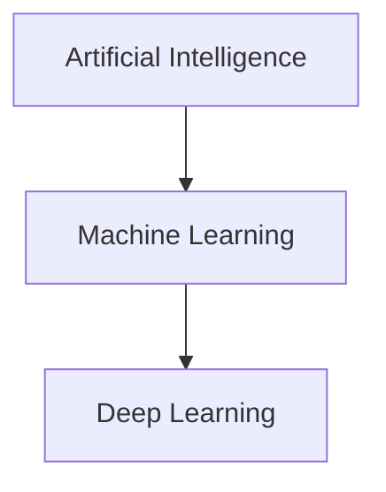

# AI vs Machine Learning vs Deep Learning

## Definition
Artificial Intelligence (AI) is the broad field of building systems that perform tasks requiring human intelligence. Machine Learning (ML) is a subset of AI where systems learn patterns from data. Deep Learning (DL) is a subset of ML using multi-layer neural networks.

## Why is it needed?
AI solves complex decision problems. ML removes the need for explicit programming. DL automatically learns complex features from large datasets.

## Relationship

## Comparison
| AI | ML | DL |
|---|---|---|
| Rule based + Learning | Learns from data | Learns hierarchical representations |
| Broad field | Subset of AI | Subset of ML |

## Real-world examples
- AI: Chess engine
- ML: Spam detection
- DL: ChatGPT, Image recognition

## Interview Answer (30 sec)
AI is the umbrella discipline. Machine Learning is an AI technique where models learn patterns from data instead of being explicitly programmed. Deep Learning is a specialized form of ML that uses deep neural networks to learn complex representations and powers modern applications like LLMs and computer vision.