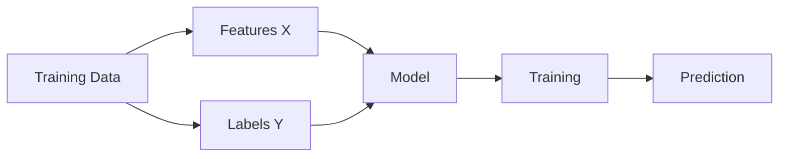

# Supervised Learning

## Definition
Supervised Learning is a machine learning paradigm where a model learns a mapping from inputs (X) to labeled outputs (Y) using historical data.

## Why do we need it?
It enables prediction for unseen data by learning patterns from labeled examples.

## Workflow


## Types
- Regression: Predict continuous values.
- Classification: Predict discrete classes.

## Real-world Applications
- Spam Detection
- House Price Prediction
- Credit Risk
- Medical Diagnosis

## Advantages
- High accuracy with quality labels.
- Easy evaluation.

## Limitations
- Requires labeled datasets.
- Labeling can be expensive.
- Can overfit.

## Interview Tip
Always mention that supervised learning minimizes a loss function using labeled data and generalizes to unseen samples.

## Python Example
```python
from sklearn.linear_model import LinearRegression
model=LinearRegression()
model.fit(X_train,y_train)
pred=model.predict(X_test)
```

## Common Questions
- Difference between regression and classification?
- What is overfitting?
- How do you evaluate supervised models?
