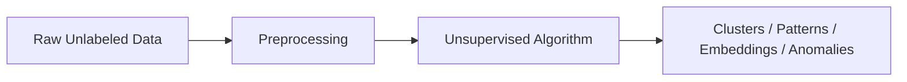

# Unsupervised Learning

## Definition
Unsupervised Learning is a machine learning approach where models discover hidden structures and relationships in unlabeled data.

## Why is it needed?
When labels are unavailable or expensive, unsupervised learning helps identify patterns, clusters, anomalies, and latent representations.

## Learning Pipeline


## Main Types
- Clustering (K-Means, DBSCAN, Hierarchical)
- Dimensionality Reduction (PCA, t-SNE, UMAP)
- Association Rule Mining
- Anomaly Detection

## Real-world Applications
- Customer Segmentation
- Recommendation Systems
- Fraud Detection
- Topic Modeling
- Image Compression

## Advantages
- No labeled data required.
- Useful for exploratory data analysis.
- Discovers hidden relationships.

## Limitations
- Hard to evaluate.
- Results may be difficult to interpret.
- Sensitive to preprocessing and feature scaling.

## Interview Tip
Mention that the objective is to discover the inherent structure of data rather than predict known labels.

## Python Example
```python
from sklearn.cluster import KMeans
model = KMeans(n_clusters=3)
labels = model.fit_predict(X)
```

## Common Interview Questions
- Difference between supervised and unsupervised learning?
- Explain K-Means.
- How do you evaluate clustering?
- What is PCA and why is it useful?
