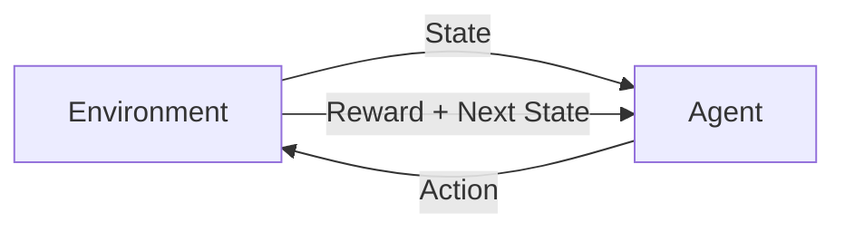
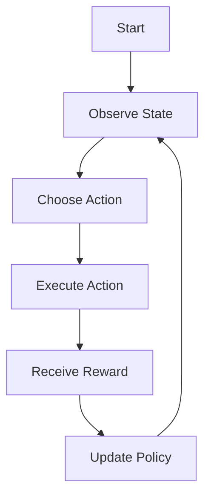

# Reinforcement Learning (RL)

## Definition
Reinforcement Learning is a machine learning paradigm where an agent learns by interacting with an environment, taking actions, receiving rewards, and improving its policy to maximize long-term cumulative reward.

## Core Components
- Agent
- Environment
- State
- Action
- Reward
- Policy
- Value Function

## RL Interaction Cycle

## Learning Process

## Types
- Model-Based RL
- Model-Free RL
- Value-Based (Q-Learning, DQN)
- Policy-Based (REINFORCE)
- Actor-Critic (PPO, A2C)

## Applications
- Robotics
- Autonomous Driving
- Game Playing (AlphaGo)
- Recommendation Systems
- LLM Reinforcement Fine-Tuning (RLHF)

## Advantages
- Learns through experience.
- Suitable for sequential decision making.
- Optimizes long-term reward.

## Limitations
- Data inefficient.
- High training cost.
- Reward design is difficult.

## Interview Tip
Mention that unlike supervised learning, RL has no labeled answers; the agent learns from delayed rewards while balancing exploration and exploitation.
