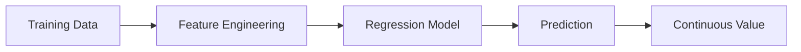

# Regression

## Definition
Regression is a supervised machine learning task used to predict continuous numerical values by learning the relationship between input features and a target variable.

## Examples
- House price prediction
- Sales forecasting
- Temperature prediction
- Stock demand estimation

## Workflow


## Common Algorithms
- Linear Regression
- Polynomial Regression
- Ridge Regression
- Lasso Regression
- Elastic Net
- Decision Tree Regressor
- Random Forest Regressor
- XGBoost Regressor

## Evaluation Metrics
- MAE
- MSE
- RMSE
- R² Score

## Advantages
- Easy to interpret.
- Fast training.
- Strong baseline for many problems.

## Limitations
- Sensitive to outliers.
- Can underfit complex relationships.

## Python Example
```python
from sklearn.linear_model import LinearRegression
model = LinearRegression()
model.fit(X_train, y_train)
pred = model.predict(X_test)
```

## Interview Questions
- Difference between regression and classification?
- Explain Linear Regression assumptions.
- What is R² Score?
- When would you use Ridge vs Lasso?
