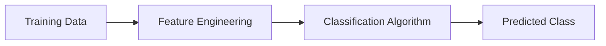

# Classification

## Definition
Classification is a supervised machine learning task where the goal is to predict a discrete category or class label from input features.

## Why Classification?
Many business problems require choosing between predefined classes rather than predicting continuous values.

## Examples
- Spam vs Not Spam
- Fraud vs Legitimate Transaction
- Disease Detection
- Sentiment Analysis
- Image Classification

## Workflow


## Types
- Binary Classification
- Multi-Class Classification
- Multi-Label Classification

## Popular Algorithms
- Logistic Regression
- Decision Tree
- Random Forest
- SVM
- Naive Bayes
- XGBoost
- Neural Networks

## Evaluation Metrics
- Accuracy
- Precision
- Recall
- F1-Score
- ROC-AUC
- Confusion Matrix

## Advantages
- Simple to evaluate.
- Wide range of algorithms.
- Applicable across many domains.

## Limitations
- Class imbalance can reduce performance.
- Incorrect feature engineering impacts accuracy.

## Python Example
```python
from sklearn.linear_model import LogisticRegression
model = LogisticRegression()
model.fit(X_train, y_train)
pred = model.predict(X_test)
```

## Interview Questions
- Difference between regression and classification?
- What is a confusion matrix?
- When do you use Precision instead of Recall?
- Explain ROC-AUC.
