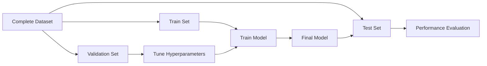

# Train, Validation and Test Split

## Definition
A Train-Validation-Test split divides a dataset into separate subsets so a machine learning model can be trained, tuned, and evaluated fairly on unseen data.

## Why is it Needed?
- Prevents data leakage.
- Measures true generalization.
- Enables hyperparameter tuning without bias.

## Workflow


## Typical Split Ratios
| Dataset Size | Train | Validation | Test |
|---|---:|---:|---:|
| Large | 80% | 10% | 10% |
| Medium | 70% | 15% | 15% |
| Small | Use Cross Validation | - | Holdout |

## Responsibilities
- **Train Set:** Learn patterns.
- **Validation Set:** Tune hyperparameters and choose the best model.
- **Test Set:** Final unbiased evaluation.

## Common Mistakes
- Using test data during training.
- Tuning hyperparameters on the test set.
- Random splitting for time-series data.

## Best Practices
- Shuffle data when appropriate.
- Stratify for imbalanced classification.
- Keep the test set untouched until the very end.

## Python Example
```python
from sklearn.model_selection import train_test_split
X_train, X_temp, y_train, y_temp = train_test_split(X, y, test_size=0.3, random_state=42)
X_val, X_test, y_val, y_test = train_test_split(X_temp, y_temp, test_size=0.5, random_state=42)
```

## Interview Questions
- Why do we need a validation set?
- When should you use cross validation?
- Why should the test set remain unseen?
