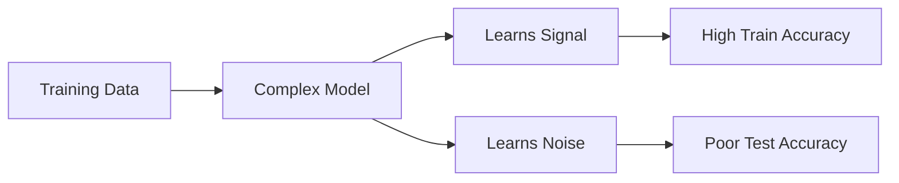

# Overfitting

## Definition
Overfitting occurs when a machine learning model learns not only the underlying patterns in the training data but also the noise and random fluctuations. As a result, it performs extremely well on the training set but poorly on unseen data.

## Why Does Overfitting Happen?
- Model is too complex.
- Too many features.
- Small training dataset.
- Excessive training epochs.
- No regularization.

## Working

## Symptoms
- Very high training accuracy.
- Large gap between training and validation performance.
- Poor generalization.

## Prevention Techniques
- Collect more data.
- Data augmentation.
- Cross Validation.
- L1/L2 Regularization.
- Dropout.
- Early Stopping.
- Simpler models.
- Feature selection.

## Real-world Example
A spam classifier memorizes the exact emails seen during training but fails to classify new spam emails correctly.

## Best Practices
- Monitor validation loss.
- Use early stopping.
- Evaluate only on unseen test data.

## Interview Questions
- What is overfitting?
- How can you detect overfitting?
- Difference between overfitting and underfitting?
- Name techniques to reduce overfitting.
