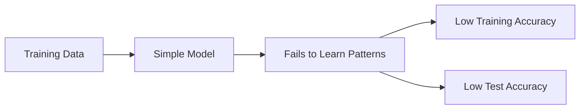

# Underfitting

## Definition
Underfitting occurs when a machine learning model is too simple to capture the underlying patterns in the training data. As a result, it performs poorly on both the training and test datasets.

## Why Does Underfitting Happen?
- Model complexity is too low.
- Insufficient training.
- Poor feature engineering.
- Excessive regularization.
- Important features are missing.

## Working

## Symptoms
- High training loss.
- Low training accuracy.
- Similar poor performance on training and validation data.

## How to Reduce Underfitting
- Increase model complexity.
- Train for more epochs.
- Add better features.
- Reduce regularization.
- Use a more expressive algorithm.

## Overfitting vs Underfitting
| Underfitting | Overfitting |
|---|---|
| Model too simple | Model too complex |
| High bias | High variance |
| Poor train accuracy | Excellent train accuracy |
| Poor test accuracy | Poor test accuracy |

## Best Practices
- Start with a simple baseline.
- Monitor learning curves.
- Balance model complexity with available data.

## Interview Questions
- What is underfitting?
- How is it different from overfitting?
- How can you reduce underfitting?
- What role does model complexity play?
