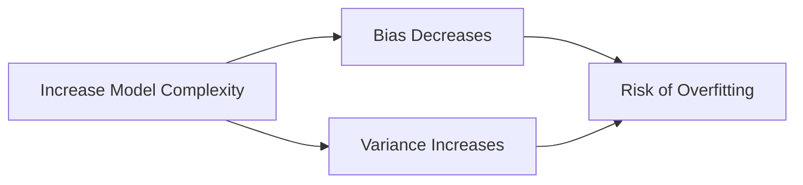

# Bias-Variance Tradeoff

## Definition
The Bias-Variance Tradeoff is a fundamental concept in machine learning that explains the balance between a model's ability to learn underlying patterns (low bias) and its sensitivity to training data fluctuations (low variance). A good model minimizes both to achieve strong generalization.

## Intuition
- High Bias → Model is too simple → Underfitting.
- High Variance → Model is too complex → Overfitting.
- Balanced Bias & Variance → Best performance on unseen data.

## Relationship

## Error Decomposition
Total Error = Bias² + Variance + Irreducible Error

## Comparison
| Bias | Variance |
|------|----------|
| Error due to simplistic assumptions | Error due to sensitivity to training data |
| Causes underfitting | Causes overfitting |
| Reduced by increasing complexity | Reduced by regularization or more data |

## How to Balance
- Choose appropriate model complexity.
- Use Cross Validation.
- Apply Regularization.
- Collect more quality data.
- Perform feature engineering.

## Best Practices
- Start simple and gradually increase complexity.
- Monitor both training and validation metrics.
- Use learning curves to diagnose problems.

## Interview Questions
- Explain the Bias-Variance Tradeoff.
- What happens when bias is high?
- What happens when variance is high?
- How can regularization help?
