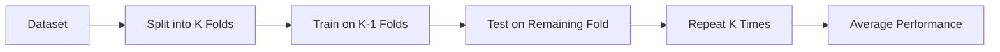

# Cross Validation

## Definition
Cross Validation is a resampling technique used to estimate how well a machine learning model generalizes to unseen data. Instead of evaluating a model using a single train-validation split, the dataset is divided into multiple folds, and the model is trained and evaluated multiple times.

## Why is Cross Validation Needed?
- Reduces overfitting risk.
- Provides a more reliable performance estimate.
- Makes efficient use of limited data.
- Helps select the best model and hyperparameters.

## K-Fold Cross Validation


## Types
- K-Fold Cross Validation
- Stratified K-Fold
- Leave-One-Out Cross Validation (LOOCV)
- Repeated K-Fold
- Time Series Cross Validation

## Advantages
- Better generalization estimate.
- Efficient for small datasets.
- Reduces dependency on a single split.

## Limitations
- Computationally expensive.
- Not suitable for all time-series problems unless sequential splitting is used.

## Best Practices
- Use Stratified K-Fold for classification.
- Use TimeSeriesSplit for sequential data.
- Combine with Grid Search or Random Search for hyperparameter tuning.

## Python Example
```python
from sklearn.model_selection import cross_val_score
from sklearn.ensemble import RandomForestClassifier

model = RandomForestClassifier()
scores = cross_val_score(model, X, y, cv=5)
print(scores.mean())
```

## Interview Questions
- What is Cross Validation?
- Why is K-Fold better than a single train-test split?
- When should you use Stratified K-Fold?
- Why is standard K-Fold not suitable for time-series data?
