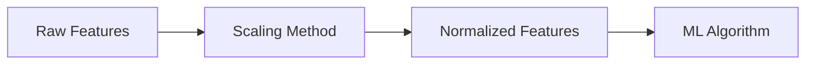

# Feature Scaling

## Definition
Feature Scaling is the process of transforming numerical features to a comparable scale so that no feature dominates others because of its magnitude. It improves optimization, convergence speed, and overall model performance for many machine learning algorithms.

## Why is Feature Scaling Needed?
- Faster gradient descent convergence.
- Prevents large-scale features from dominating.
- Improves distance-based algorithms.
- Stabilizes optimization.



## Scaling Techniques
- **Min-Max Normalization:** Maps values to [0,1].
- **Standardization (Z-Score):** Mean = 0, Std = 1.
- **Robust Scaling:** Uses median and IQR for outlier resistance.
- **MaxAbs Scaling:** Scales by maximum absolute value.
- **Unit Vector Scaling:** Makes feature vectors unit length.

## Algorithms That Need Scaling
- KNN
- K-Means
- SVM
- Logistic Regression
- Linear Regression (Gradient Descent)
- PCA
- Neural Networks

## Algorithms That Don't Usually Need Scaling
- Decision Trees
- Random Forest
- XGBoost
- LightGBM
- CatBoost

## Python Example
```python
from sklearn.preprocessing import StandardScaler
scaler = StandardScaler()
X_scaled = scaler.fit_transform(X)
```

## Best Practices
- Fit scaler only on training data.
- Apply the same scaler to validation and test sets.
- Save the fitted scaler for inference.
- Include scaling inside a preprocessing pipeline.

## Interview Questions
- Difference between normalization and standardization?
- Which algorithms require scaling?
- Why shouldn't you fit the scaler on test data?
- When should RobustScaler be preferred?
