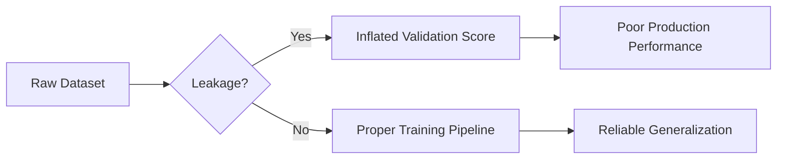

# Data Leakage

## Definition
Data Leakage occurs when information unavailable at prediction time is unintentionally used during model training, causing unrealistically high evaluation scores and poor real-world performance.

## Why It Is Dangerous
- Produces misleadingly high accuracy.
- Models fail after deployment.
- Invalidates model evaluation.
- Leads to poor business decisions.



## Types of Data Leakage
- **Target Leakage:** Future or target-derived information leaks into features.
- **Train-Test Contamination:** Preprocessing performed before splitting data.
- **Temporal Leakage:** Future observations are used to predict past events.
- **Duplicate Leakage:** Same or nearly identical samples appear in train and test sets.

## Common Causes
- Scaling before train-test split.
- Feature selection on the entire dataset.
- Imputing missing values using all data.
- Using future timestamps.
- Data duplication.

## Prevention
- Split data before preprocessing.
- Fit preprocessing only on training data.
- Use sklearn Pipelines.
- Keep train, validation, and test datasets isolated.
- Use time-aware validation for sequential data.

## Python Example
```python
from sklearn.pipeline import Pipeline
from sklearn.preprocessing import StandardScaler
from sklearn.linear_model import LogisticRegression

pipeline = Pipeline([
    ('scaler', StandardScaler()),
    ('model', LogisticRegression())
])
```

## Best Practices
- Audit feature sources.
- Validate production data flow.
- Avoid manual preprocessing outside pipelines.
- Monitor for distribution shifts after deployment.

## Interview Questions
- What is data leakage?
- Give examples of target leakage.
- Why should preprocessing occur after train-test split?
- How do sklearn Pipelines prevent leakage?
