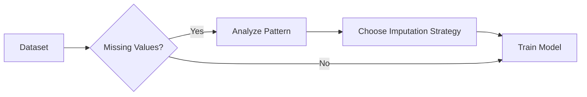

# Missing Values

## Definition
Missing values are absent or unavailable entries in a dataset. Handling them correctly is essential because many machine learning algorithms cannot process missing data directly, and poor handling can introduce bias or reduce model performance.

## Why Missing Values Occur
- Data entry errors
- Sensor failures
- User skipped fields
- Data corruption
- Integration from multiple sources



## Types of Missing Data
- **MCAR (Missing Completely At Random)**
- **MAR (Missing At Random)**
- **MNAR (Missing Not At Random)**

## Handling Techniques
- Remove rows or columns
- Mean imputation
- Median imputation
- Mode imputation
- Constant value imputation
- KNN Imputation
- Iterative (MICE) Imputation
- Model-based imputation

## Choosing the Right Method
- Mean: Normally distributed numerical data
- Median: Numerical data with outliers
- Mode: Categorical features
- KNN/MICE: Complex relationships with sufficient data

## Python Example
```python
from sklearn.impute import SimpleImputer
imputer = SimpleImputer(strategy='median')
X = imputer.fit_transform(X)
```

## Best Practices
- Understand why data is missing before imputing.
- Fit imputers only on training data.
- Preserve missingness if it carries information.
- Compare multiple imputation strategies.

## Interview Questions
- What are MCAR, MAR, and MNAR?
- When should median be preferred over mean?
- What is MICE imputation?
- Can missing values themselves contain useful information?
