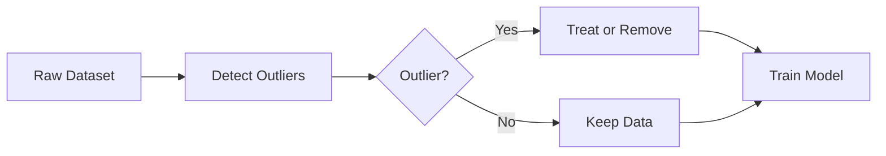

# Outlier Detection

## Definition
Outliers are observations that differ significantly from the majority of data points. They may result from measurement errors, rare events, or genuine but uncommon behavior. Detecting and handling outliers is important because they can distort statistical analysis and degrade machine learning models.

## Why Detect Outliers?
- Improve model accuracy
- Reduce bias in statistical measures
- Detect fraud or anomalies
- Improve data quality



## Types of Outliers
- Global Outliers
- Contextual Outliers
- Collective Outliers

## Detection Methods
- IQR (Interquartile Range)
- Z-Score
- Modified Z-Score
- Isolation Forest
- Local Outlier Factor (LOF)
- DBSCAN

## Treatment Strategies
- Remove invalid observations
- Cap values (Winsorization)
- Transform using log/sqrt
- Replace using domain knowledge
- Use robust algorithms

## Python Example
```python
from scipy.stats import zscore
import numpy as np

z = np.abs(zscore(X))
outliers = X[(z > 3).any(axis=1)]
```

## Best Practices
- Investigate the cause before removal.
- Do not remove legitimate rare events blindly.
- Use domain knowledge.
- Apply robust scaling when appropriate.

## Interview Questions
- What is an outlier?
- Difference between IQR and Z-Score?
- When should Isolation Forest be used?
- Should all outliers be removed?
