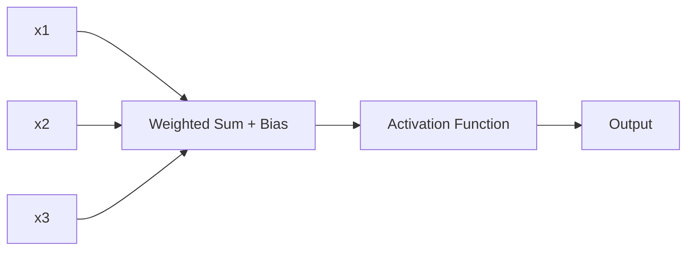

# Biological Neuron vs Artificial Neuron

## Definition
Artificial Neural Networks are inspired by biological neurons in the human brain. An artificial neuron is a mathematical model that receives inputs, applies weights and bias, computes a weighted sum, passes it through an activation function, and produces an output.

## Biological Neuron
- Dendrites receive signals
- Cell body processes information
- Axon transmits signals
- Synapses connect neurons

## Artificial Neuron
- Inputs (x1...xn)
- Weights (w1...wn)
- Bias (b)
- Weighted Sum: z = Σ(wᵢxᵢ) + b
- Activation Function: y = f(z)



## Biological vs Artificial
| Biological | Artificial |
|------------|------------|
| Dendrites | Inputs |
| Synapse Strength | Weights |
| Cell Body | Summation |
| Axon | Output |

## Why We Need Weights and Bias
- Weights determine feature importance.
- Bias shifts the activation threshold.

## Python Example
```python
import numpy as np

x = np.array([1, 2, 3])
w = np.array([0.2, 0.5, 0.8])
b = 0.1
z = np.dot(x, w) + b
print(z)
```

## Interview Questions
- Why is bias required?
- What is the role of weights?
- How does an artificial neuron mimic a biological neuron?
- Why is an activation function necessary?
