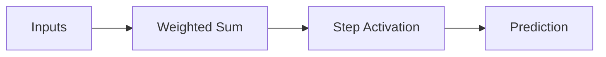

# Perceptron

## Definition
The Perceptron is the simplest artificial neural network introduced by Frank Rosenblatt in 1958. It is a binary linear classifier that learns by adjusting weights based on prediction errors.

## Architecture
- Input features
- Weights
- Bias
- Weighted sum
- Step activation
- Binary output



## Mathematical Model
z = Σ(wᵢxᵢ) + b

ŷ = 1 if z ≥ 0 else 0

## Learning Rule
w = w + η(y - ŷ)x

b = b + η(y - ŷ)

where η is the learning rate.

## Training Steps
1. Initialize weights.
2. Compute prediction.
3. Calculate error.
4. Update weights and bias.
5. Repeat until convergence.

## Limitations
- Solves only linearly separable problems.
- Cannot solve XOR.
- Uses non-differentiable step function.

## Python Example
```python
from sklearn.linear_model import Perceptron
model = Perceptron()
model.fit(X_train, y_train)
```

## Interview Questions
- What is a perceptron?
- Explain the perceptron learning rule.
- Why can't a perceptron solve XOR?
- Difference between perceptron and logistic regression?
