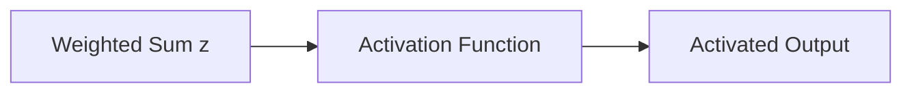

# Activation Functions

## Definition
An activation function introduces non-linearity into a neural network, enabling it to learn complex patterns beyond linear relationships.

## Why Activation Functions?
- Learn non-linear decision boundaries
- Enable deep learning
- Control neuron output
- Improve model expressiveness



## Common Activation Functions
| Function | Range | Typical Use |
|---|---|---|
| Step | {0,1} | Perceptron |
| Sigmoid | (0,1) | Binary classification |
| Tanh | (-1,1) | Hidden layers (legacy) |
| ReLU | [0,∞) | Default hidden layers |
| Leaky ReLU | (-∞,∞) | Prevent dying ReLU |
| GELU | Smooth | Transformers |
| Swish | Smooth | Modern deep networks |
| Softmax | (0,1) | Multi-class output |

## Key Equations
- Sigmoid: σ(x)=1/(1+e^-x)
- Tanh: tanh(x)
- ReLU: max(0,x)
- Leaky ReLU: max(ax,x)
- Softmax: exp(xᵢ)/Σexp(xⱼ)

## Choosing an Activation
- Hidden layers: ReLU or GELU
- Binary output: Sigmoid
- Multi-class output: Softmax
- Regression: Linear (no activation)

## Python Example
```python
import torch.nn as nn

relu = nn.ReLU()
sigmoid = nn.Sigmoid()
gelu = nn.GELU()
softmax = nn.Softmax(dim=1)
```

## Best Practices
- Use ReLU as a strong default.
- Prefer GELU for Transformer models.
- Avoid sigmoid in deep hidden layers due to vanishing gradients.

## Interview Questions
- Why is ReLU popular?
- ReLU vs Leaky ReLU?
- When should Softmax be used?
- Why does sigmoid suffer from vanishing gradients?