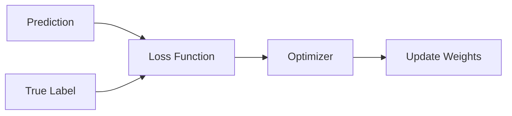

# Loss Functions

## Definition
A loss function measures how far a model's prediction is from the actual target. During training, optimization algorithms minimize this value by updating model parameters.

## Loss vs Cost
- **Loss:** Error for a single training example.
- **Cost:** Average loss across the entire dataset or batch.



## Regression Losses
| Loss | Formula | Use Case |
|------|---------|----------|
| MAE | Mean Absolute Error | Robust to outliers |
| MSE | Mean Squared Error | Standard regression |
| RMSE | √MSE | Interpretable error |
| Huber | MAE + MSE | Mixed robustness |

## Classification Losses
| Loss | Use Case |
|------|----------|
| Binary Cross Entropy | Binary classification |
| Categorical Cross Entropy | Multi-class classification |
| Sparse Cross Entropy | Integer labels |
| Hinge Loss | Support Vector Machines |
| Focal Loss | Imbalanced datasets |

## Choosing the Right Loss
- Regression → MSE or Huber
- Binary Classification → Binary Cross Entropy
- Multi-class Classification → Categorical Cross Entropy
- Imbalanced Classification → Focal Loss

## PyTorch Example
```python
import torch.nn as nn

mse = nn.MSELoss()
bce = nn.BCELoss()
ce = nn.CrossEntropyLoss()
```

## Best Practices
- Match the loss function to the task.
- Pair Cross Entropy with Softmax or Logits appropriately.
- Monitor both training and validation loss.

## Interview Questions
- Difference between loss and cost?
- Why is MSE preferred over MAE in many regression tasks?
- When should Focal Loss be used?
- Why is Cross Entropy preferred for classification?