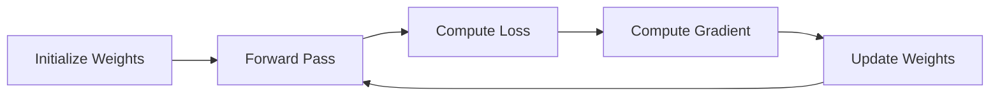

# Gradient Descent

## Definition
Gradient Descent is an optimization algorithm used to minimize a model's loss function by iteratively updating parameters in the direction opposite to the gradient.

## Intuition
Imagine standing on a mountain in the fog. The gradient tells you the steepest uphill direction, so moving in the opposite direction helps you reach the valley (minimum loss).



## Update Rule
**w = w - η × ∂L/∂w**

Where:
- w = weight
- η = learning rate
- L = loss function
- ∂L/∂w = gradient

## Types of Gradient Descent
| Type | Characteristics |
|------|------------------|
| Batch GD | Uses entire dataset, stable but slow |
| Stochastic GD (SGD) | One sample at a time, fast but noisy |
| Mini-Batch GD | Small batches, balances speed and stability |

## Learning Rate
- Too small → Slow convergence
- Too large → Overshooting or divergence
- Proper value → Fast and stable convergence

## Common Challenges
- Local minima
- Saddle points
- Plateaus
- Vanishing gradients

## Python Example
```python
optimizer = torch.optim.SGD(model.parameters(), lr=0.01)
```

## Best Practices
- Start with mini-batch gradient descent.
- Tune the learning rate carefully.
- Use adaptive optimizers (Adam, RMSProp) for many deep learning tasks.

## Interview Questions
- What is Gradient Descent?
- Why do we move opposite the gradient?
- Compare Batch, SGD, and Mini-Batch GD.
- How does the learning rate affect training?