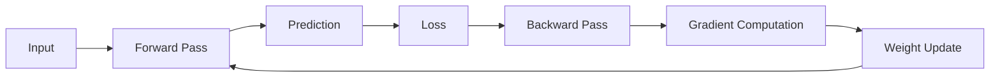

# Backpropagation

## Definition
Backpropagation is the algorithm used to train neural networks by computing the gradient of the loss function with respect to every trainable parameter using the chain rule of calculus.

## Why Backpropagation?
- Computes gradients efficiently
- Enables learning in deep neural networks
- Updates weights to minimize loss



## Training Steps
1. Initialize weights.
2. Perform forward propagation.
3. Compute loss.
4. Compute gradients using the chain rule.
5. Update weights using gradient descent.
6. Repeat until convergence.

## Chain Rule
For each layer:

∂L/∂W = (∂L/∂A) × (∂A/∂Z) × (∂Z/∂W)

This allows gradients to propagate from the output layer back to the input layer.

## Challenges
- Vanishing gradients
- Exploding gradients
- Saturating activation functions

## PyTorch Example
```python
loss.backward()
optimizer.step()
optimizer.zero_grad()
```

## Best Practices
- Use ReLU/GELU to reduce vanishing gradients.
- Normalize inputs.
- Use proper weight initialization.
- Consider gradient clipping for very deep models.

## Interview Questions
- What is backpropagation?
- Why is the chain rule important?
- What causes vanishing gradients?
- Why call optimizer.zero_grad()?