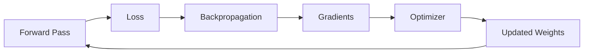

# Optimizers

## Definition
An optimizer updates a neural network's parameters using gradients computed during backpropagation to minimize the loss function efficiently.

## Why Optimizers?
- Speed up convergence
- Improve training stability
- Escape poor optimization paths
- Adapt learning during training



## Popular Optimizers
| Optimizer | Key Idea | Best For |
|-----------|----------|----------|
| SGD | Simple gradient updates | Small models |
| Momentum | Uses previous gradients | Faster convergence |
| NAG | Looks ahead before updating | Improved momentum |
| AdaGrad | Adaptive learning rate | Sparse features |
| RMSProp | Moving average of gradients | RNNs |
| Adam | Momentum + RMSProp | General deep learning |
| AdamW | Adam with decoupled weight decay | Transformers |

## Update Equation (SGD)
w = w - η∇L

## PyTorch Example
```python
optimizer = torch.optim.Adam(model.parameters(), lr=1e-3)
```

## Best Practices
- Start with Adam for most tasks.
- Use AdamW for Transformer models.
- Tune the learning rate before changing optimizers.
- Apply learning rate schedulers for long training runs.

## Interview Questions
- SGD vs Adam?
- Why is Adam widely used?
- What problem does AdamW solve?
- When would you choose RMSProp?