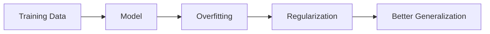

# Regularization

## Definition
Regularization is a set of techniques used to reduce overfitting by preventing a neural network from learning noise in the training data.

## Why Regularization?
- Improves generalization
- Reduces overfitting
- Produces simpler models
- Increases robustness on unseen data



## Common Techniques
| Technique | Purpose |
|-----------|---------|
| L1 (Lasso) | Feature selection, sparse weights |
| L2 (Weight Decay) | Penalizes large weights |
| Elastic Net | Combines L1 and L2 |
| Dropout | Randomly disables neurons |
| Early Stopping | Stops before overfitting |
| Data Augmentation | Creates more training samples |

## Loss Function with Regularization
- L1: Loss + λΣ|w|
- L2: Loss + λΣw²

## PyTorch Example
```python
optimizer = torch.optim.AdamW(model.parameters(), lr=1e-3, weight_decay=1e-2)

dropout = torch.nn.Dropout(p=0.5)
```

## Best Practices
- Use Dropout in deep networks.
- Prefer L2 (weight decay) for most tasks.
- Monitor validation loss and apply early stopping.
- Combine data augmentation with regularization.

## Interview Questions
- What is overfitting?
- L1 vs L2 regularization?
- Why does Dropout work?
- What is Early Stopping?