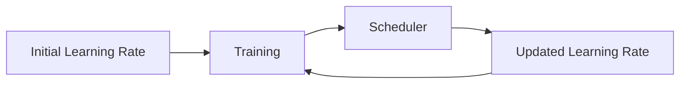

# Learning Rate Scheduling

## Definition
Learning rate scheduling is the process of automatically adjusting the learning rate during training to improve convergence and final model performance.

## Why Use It?
- Faster convergence
- Better final accuracy
- Prevents overshooting minima
- Improves training stability



## Common Schedulers
| Scheduler | Description |
|-----------|-------------|
| StepLR | Reduces LR after fixed epochs |
| ExponentialLR | Exponential decay |
| CosineAnnealingLR | Cosine decay schedule |
| ReduceLROnPlateau | Lowers LR when metric stops improving |
| OneCycleLR | Warm-up then decay |

## Warm-up
Start with a small learning rate and gradually increase it before applying the main schedule.

## PyTorch Example
```python
optimizer = torch.optim.Adam(model.parameters(), lr=1e-3)
scheduler = torch.optim.lr_scheduler.CosineAnnealingLR(optimizer, T_max=50)

for epoch in range(50):
    train()
    scheduler.step()
```

## Best Practices
- Combine AdamW with cosine annealing for Transformers.
- Use ReduceLROnPlateau for validation-driven training.
- Always monitor learning curves.

## Interview Questions
- Why change the learning rate during training?
- Cosine Annealing vs StepLR?
- What is learning rate warm-up?
- When should ReduceLROnPlateau be used?