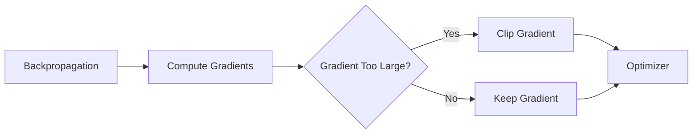

# Gradient Clipping

## Definition
Gradient clipping is a technique that limits the magnitude of gradients during backpropagation to prevent exploding gradients and stabilize training.

## Why Gradient Clipping?
- Prevents exploding gradients
- Stabilizes training
- Enables deeper networks
- Commonly used in RNNs, Transformers and LLMs



## Types
| Method | Description |
|--------|-------------|
| Clip by Value | Limit each gradient value to a fixed range |
| Clip by Norm | Scale gradients if overall norm exceeds a threshold |

## Mathematical Intuition
If ||g|| > threshold:

g = g × (threshold / ||g||)

## PyTorch Example
```python
loss.backward()
torch.nn.utils.clip_grad_norm_(model.parameters(), max_norm=1.0)
optimizer.step()
```

## Best Practices
- Use clip-by-norm for most deep learning models.
- Typical thresholds range from 0.5 to 5.0.
- Particularly useful for RNNs and large Transformer models.

## Interview Questions
- What are exploding gradients?
- Gradient clipping by value vs by norm?
- Why is gradient clipping important for LLMs?
- When should gradient clipping be applied?