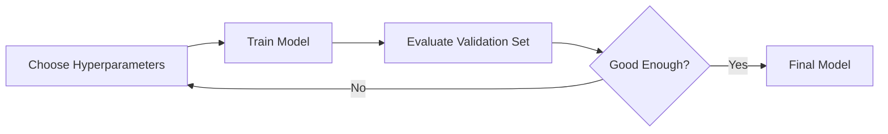

# Hyperparameter Tuning

## Definition
Hyperparameter tuning is the process of finding the optimal set of hyperparameters that maximize a model's performance on unseen data.

## Parameters vs Hyperparameters
| Parameters | Hyperparameters |
|------------|-----------------|
| Learned during training | Set before training |
| Weights and biases | Learning rate, batch size, epochs, dropout, optimizer |

## Why Tune Hyperparameters?
- Improve accuracy
- Reduce overfitting
- Faster convergence
- Better generalization



## Common Search Methods
- Grid Search
- Random Search
- Bayesian Optimization
- Hyperband
- ASHA
- Population Based Training (PBT)

## PyTorch + Optuna Example
```python
import optuna

def objective(trial):
    lr = trial.suggest_float('lr',1e-5,1e-2,log=True)
    return train_model(lr)
```

## Best Practices
- Tune learning rate first.
- Use random search before grid search.
- Use Bayesian optimization for expensive models.
- Track experiments with MLflow or Weights & Biases.

## Interview Questions
- Parameters vs hyperparameters?
- Why is random search often better than grid search?
- What is Bayesian optimization?
- Which hyperparameters matter the most?