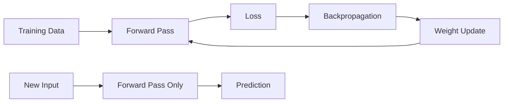

# Training vs Inference

## Definition
Training is the phase where a model learns from data by updating its weights using loss and gradients. Inference is the phase where a trained model makes predictions on new unseen data without updating weights.

## Why This Difference Matters
- Training is compute-heavy and memory-heavy.
- Inference must be fast and reliable.
- Behavior of BatchNorm and Dropout changes between the two modes.
- Production systems care more about latency, throughput, and stability.



## Training Pipeline
1. Load data in batches.
2. Run forward pass.
3. Compute loss.
4. Run backpropagation.
5. Update weights.
6. Repeat for many epochs.

## Inference Pipeline
1. Load trained model weights.
2. Disable gradient computation.
3. Run only the forward pass.
4. Return prediction.

## `model.train()` vs `model.eval()`
- `model.train()` enables training behavior like Dropout and BatchNorm updates.
- `model.eval()` switches the model to inference behavior.

## Important Differences
| Aspect | Training | Inference |
|---|---|---|
| Gradients | Enabled | Disabled |
| Weight updates | Yes | No |
| Dropout | Active | Inactive |
| BatchNorm | Uses batch stats | Uses running stats |
| Goal | Learn | Predict |

## PyTorch Example
```python
model.train()
for x, y in train_loader:
    optimizer.zero_grad()
    pred = model(x)
    loss = criterion(pred, y)
    loss.backward()
    optimizer.step()

model.eval()
with torch.no_grad():
    pred = model(new_input)
```

## Production Considerations
- Inference usually runs on CPU or optimized GPU/accelerator.
- Batch size affects latency and throughput.
- Use quantization, pruning, or distillation to reduce inference cost.
- Avoid accidental training mode in production.

## Interview Questions
- What is the difference between training and inference?
- Why do we use `model.eval()`?
- What happens if Dropout is left on during inference?
- Why is inference cheaper than training?