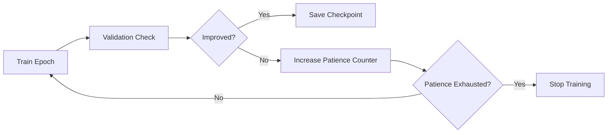

# Model Checkpointing and Early Stopping

## Definition
Model checkpointing saves the model's weights during training so progress is not lost and the best version can be restored later. Early stopping halts training when validation performance stops improving to prevent overfitting.

## Why This Is Needed
- Training can take hours or days.
- Crashes or interruptions should not waste progress.
- The best validation model is not always the last epoch.
- Early stopping saves time and improves generalization.



## Checkpointing
Common items to save:
- Model state dict
- Optimizer state
- Epoch number
- Scheduler state
- Best validation metric

## Early Stopping
Early stopping monitors a validation metric such as loss or accuracy and stops training after no improvement for a set number of epochs called patience.

## PyTorch Example
```python
if val_loss < best_loss:
    best_loss = val_loss
    torch.save(model.state_dict(), "best_model.pt")
    patience_counter = 0
else:
    patience_counter += 1
    if patience_counter >= patience:
        break
```

## Best Practices
- Save the best checkpoint separately from the latest checkpoint.
- Always monitor validation metrics, not training metrics.
- Restore the best model before final evaluation.
- Use patience instead of stopping on a single bad epoch.

## Interview Questions
- Why is checkpointing important?
- What is early stopping?
- What is patience in early stopping?
- Should you stop based on training loss or validation loss?