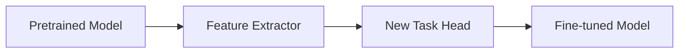

# Transfer Learning

## Definition
Transfer learning is a technique where a model trained on one task is reused as the starting point for a different but related task.

## Why It Works
- Early layers often learn general features.
- Reusing pretrained weights saves time and compute.
- It works well when the target dataset is small.



## Two Common Modes
| Mode | Description |
|---|---|
| Feature Extraction | Freeze pretrained layers and train only the new head |
| Fine-Tuning | Unfreeze some or all layers and continue training |

## Common Pretrained Backbones
- CNNs: ResNet, EfficientNet, ConvNeXt, ViT
- NLP: BERT, RoBERTa, T5, Llama

## PyTorch Example
```python
from torchvision import models
model = models.resnet50(weights='DEFAULT')
for param in model.parameters():
    param.requires_grad = False
```

## Best Practices
- Freeze most layers first.
- Replace the final classification head for the new task.
- Use a smaller learning rate when unfreezing.
- Validate carefully to avoid overfitting on small data.

## Interview Questions
- What is transfer learning?
- Feature extraction vs fine-tuning?
- Why does transfer learning help with small datasets?
- When would transfer learning fail?