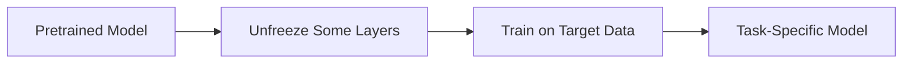

# Fine-Tuning

## Definition
Fine-tuning is the process of continuing training on a pretrained model so that it adapts to a specific target task or domain.

## Why Fine-Tuning?
- Improves task-specific performance
- Adapts generic pretrained knowledge to your dataset
- Works better than training from scratch for many tasks
- Useful when the target data is limited but related to the source task



## Common Strategies
| Strategy | Description |
|---|---|
| Full Fine-Tuning | Update all parameters |
| Partial Fine-Tuning | Freeze most layers and update only some layers |
| Layer-wise LR Decay | Use different learning rates per layer |
| PEFT | LoRA, Adapters, Prefix Tuning |

## Important Risk
- **Catastrophic forgetting:** the model can forget useful general knowledge if fine-tuned too aggressively.

## LoRA Intuition
Instead of updating the entire large weight matrix, LoRA learns a low-rank update that is cheaper to train and store.

## PyTorch Example
```python
for name, param in model.named_parameters():
    if "layer4" not in name:
        param.requires_grad = False
```

## Best Practices
- Start with feature extraction, then unfreeze gradually.
- Use a smaller learning rate than training from scratch.
- Watch validation metrics closely.
- Prefer PEFT methods for large LLMs when compute is limited.

## Interview Questions
- What is fine-tuning?
- Full vs partial fine-tuning?
- What is catastrophic forgetting?
- Why is LoRA useful?