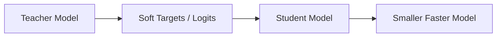

# Knowledge Distillation

## Definition
Knowledge distillation is a compression technique where a smaller student model learns to imitate a larger teacher model.

## Why Use It?
- Reduce inference cost
- Lower memory usage
- Faster deployment
- Keep much of the teacher's performance



## Core Idea
The student does not only learn hard labels. It also learns the softer probability distribution produced by the teacher, which contains richer information about class similarities.

## Common Distillation Signals
- Soft logits
- Intermediate feature maps
- Attention maps
- Hidden states

## Loss Structure
Distillation loss is often a combination of:
- Hard label loss
- Soft target loss

## PyTorch Example
```python
student_loss = ce_loss(student_logits, labels)
teacher_soft_loss = kl_div(student_logits, teacher_logits)
total_loss = alpha * student_loss + (1 - alpha) * teacher_soft_loss
```

## Best Practices
- Use a strong teacher.
- Tune temperature carefully.
- Distill both logits and features when possible.
- Validate speed and quality trade-off.

## Interview Questions
- What is knowledge distillation?
- Why do soft labels help?
- Teacher vs student model?
- Where is distillation used in production?