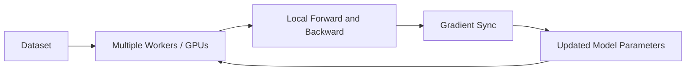

# Distributed Training

## Definition
Distributed training is the process of training a model across multiple GPUs, multiple machines, or both so that large models and large datasets can be trained faster and at larger scale.

## Why It Is Needed
- Single-GPU training becomes too slow.
- Some models do not fit into one GPU memory.
- Larger batch sizes and faster iteration become possible.
- Modern LLMs and foundation models often require distributed systems.



## Main Parallelism Strategies
| Strategy | Idea |
|---|---|
| Data Parallelism | Split batches across devices and sync gradients |
| Model Parallelism | Split the model across devices |
| Tensor Parallelism | Split large tensors across devices |
| Pipeline Parallelism | Split layers into stages across devices |

## Distributed Data Parallel (DDP)
DDP is the most common practical approach. Each GPU gets a replica of the model and a different mini-batch. Gradients are synchronized across GPUs using AllReduce.

## AllReduce Intuition
Each worker computes gradients locally, then the system sums or averages them so every replica stays in sync.

## PyTorch DDP Example
```python
import torch.distributed as dist
from torch.nn.parallel import DistributedDataParallel as DDP

model = model.to(device)
model = DDP(model, device_ids=[local_rank])
```

## Important Concepts
- World size: total number of processes
- Rank: unique ID of each process
- Barrier: synchronization point
- Communication overhead: cost of syncing gradients

## Best Practices
- Start with DDP before trying more complex parallelism.
- Use gradient accumulation when batch size is constrained.
- Monitor communication bottlenecks.
- Pin each process to a single GPU.

## Interview Questions
- What is distributed training?
- Data parallelism vs model parallelism?
- What is DDP?
- Why is AllReduce important?