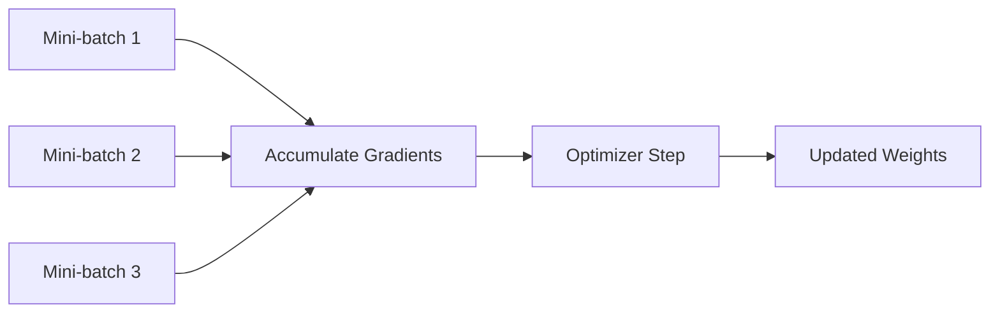

# Gradient Accumulation

## Definition
Gradient accumulation is a training technique where gradients from multiple mini-batches are accumulated before performing a single optimizer step. It simulates a larger batch size without requiring extra GPU memory.

## Why It Is Useful
- Enables effective large-batch training on limited hardware
- Reduces memory pressure
- Stabilizes optimization in some setups
- Helpful when training large models or when GPUs are small



## How It Works
1. Run forward and backward pass on a mini-batch.
2. Do not call optimizer step yet.
3. Repeat for N mini-batches.
4. After N steps, update the weights once.
5. Zero the gradients and repeat.

## Why It Mimics a Larger Batch
If you accumulate gradients over 4 batches before stepping, the optimization behaves similarly to using a batch size 4 times larger, while memory use stays closer to a small batch.

## PyTorch Example
```python
optimizer.zero_grad()
for i, (x, y) in enumerate(loader):
    pred = model(x)
    loss = criterion(pred, y) / accumulation_steps
    loss.backward()

    if (i + 1) % accumulation_steps == 0:
        optimizer.step()
        optimizer.zero_grad()
```

## Important Notes
- Divide the loss by the accumulation steps so the gradient scale stays correct.
- BatchNorm statistics still depend on the actual mini-batch size.
- Gradient accumulation does not replace true distributed data parallelism.

## Best Practices
- Use it when memory limits prevent larger batches.
- Keep learning rate consistent with the effective batch size.
- Verify validation performance after changing accumulation steps.

## Interview Questions
- What is gradient accumulation?
- How is it different from a larger batch size?
- Why divide the loss by accumulation steps?
- Does it help with GPU memory limits?