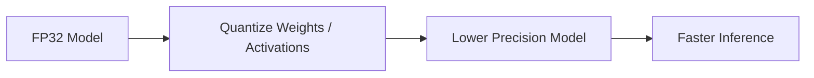

# Quantization

## Definition
Quantization is the process of reducing the numerical precision of model weights and activations, usually from FP32 to lower-bit formats such as FP16, INT8, or even INT4, to reduce memory usage and speed up inference.

## Why Quantization?
- Lower model size
- Faster inference
- Reduced memory bandwidth
- Lower deployment cost
- Better edge and mobile viability



## Common Quantization Types
| Type | Description |
|---|---|
| Post-Training Quantization | Quantize after training is complete |
| Quantization-Aware Training | Train the model with quantization simulated |
| Dynamic Quantization | Quantize on the fly for some layers |
| Static Quantization | Calibrate activations using data |

## Common Bit Widths
- FP16 / BF16: mixed precision, often used in training and inference
- INT8: common for production inference
- INT4: aggressive compression, often used for LLMs

## PyTorch Example
```python
import torch.quantization as quantization

model_int8 = quantization.quantize_dynamic(
    model, {torch.nn.Linear}, dtype=torch.qint8
)
```

## Trade-offs
- More quantization usually means more speed and less memory.
- Too much quantization can reduce accuracy.
- Some hardware supports certain formats better than others.

## Best Practices
- Start with INT8 before trying more aggressive compression.
- Validate accuracy after quantization.
- Use calibration data for static quantization.
- Prefer hardware-supported formats.

## Interview Questions
- What is quantization?
- Post-training quantization vs QAT?
- Why does quantization help inference?
- What accuracy risks come with INT4?