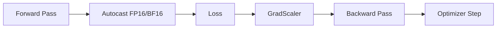

# Automatic Mixed Precision

## Definition
Automatic Mixed Precision (AMP) is a training technique that automatically chooses lower precision where safe and higher precision where needed so models can train faster and use less memory.

## Why AMP?
- Faster training on modern hardware
- Lower memory usage
- Easier than manually managing precision
- Works well with large deep learning and LLM workloads



## Core Idea
Use reduced precision for matrix multiplications and activations where possible, while keeping numerically sensitive operations in higher precision.

## Key Components
- `autocast` for automatic casting
- `GradScaler` for loss scaling when needed
- FP16 or BF16 execution on supported devices

## PyTorch Example
```python
scaler = torch.cuda.amp.GradScaler()

for x, y in loader:
    optimizer.zero_grad()
    with torch.cuda.amp.autocast():
        pred = model(x)
        loss = criterion(pred, y)
    scaler.scale(loss).backward()
    scaler.step(optimizer)
    scaler.update()
```

## AMP vs Manual Mixed Precision
| AMP | Manual Mixed Precision |
|---|---|
| Easier | More control |
| Safer | More error-prone |
| Framework-managed casts | User handles casts |

## Best Practices
- Prefer AMP when using GPUs that support it.
- Check for NaNs during training.
- Combine with gradient clipping if needed.
- Use BF16 where available if stability is an issue.

## Interview Questions
- What is AMP?
- Why use autocast?
- What does GradScaler do?
- How is AMP different from plain FP16 training?