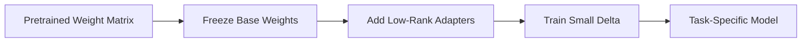

# LoRA

## Definition
LoRA (Low-Rank Adaptation) is a parameter-efficient fine-tuning method that freezes the original pretrained weights and learns small low-rank adapter matrices instead.

## Why LoRA?
- Fine-tune large models with much less memory
- Fewer trainable parameters
- Faster and cheaper experimentation
- Easier to store and deploy adapter weights

## Core Idea
Instead of updating the full matrix W, LoRA learns a low-rank update:

W' = W + BA

where B and A are much smaller matrices.

## Where It Is Used
- LLM fine-tuning
- Multimodal models
- Vision transformers
- Resource-constrained training setups

## PyTorch Intuition
LoRA is usually applied to attention projection matrices or linear layers so that only adapter parameters are updated.

## Advantages
- Much fewer trainable parameters
- Lower GPU memory usage
- Smaller checkpoints
- Easier to support many tasks with one base model

## Trade-offs
- Adds some architectural complexity
- Not always as strong as full fine-tuning for very large domain shifts
- Needs careful placement of adapters

## Best Practices
- Start with attention layers in LLMs.
- Tune rank carefully.
- Keep the base model frozen.
- Merge adapters only when needed for deployment.

## Interview Questions
- What is LoRA?
- Why is it parameter-efficient?
- LoRA vs full fine-tuning?
- Where should adapters be added?