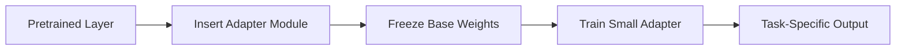

# Adapters

## Definition
Adapters are small trainable modules inserted into a pretrained network while keeping the original model weights frozen. They let you adapt a large model to a new task using only a small number of extra parameters.

## Why Adapters?
- Lower training cost
- Less memory usage
- Easy to store and switch between tasks
- Useful for multi-task and domain-specific fine-tuning

## How They Work
A small bottleneck network is inserted inside or after a transformer block. The base layer stays fixed, and only the adapter learns the task-specific change.

## Common Adapter Structure
- Down projection
- Non-linearity
- Up projection

This creates a compact residual path with very few parameters.

## Where Adapters Help
- NLP fine-tuning
- LLM adaptation
- Domain transfer
- Multi-tenant model serving

## Advantages
- Faster training than full fine-tuning
- Easy to keep multiple task adapters
- Base model remains stable
- Good for memory-constrained setups

## Trade-offs
- Slightly more inference overhead than pure LoRA in some designs
- Adds architectural complexity
- Can underperform full fine-tuning for some large domain shifts

## Best Practices
- Keep adapters small.
- Insert them at consistent points in the network.
- Freeze the backbone initially.
- Validate whether adapter fusion is needed at inference.

## Interview Questions
- What are adapters in fine-tuning?
- How are adapters different from LoRA?
- Why freeze the backbone?
- When would you use adapters instead of full fine-tuning?