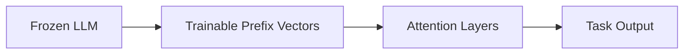

# Prefix Tuning

## Definition
Prefix tuning is a parameter-efficient fine-tuning method where a small set of trainable prefix vectors is added to the model's attention layers while the base model weights remain frozen.

## Why Prefix Tuning?
- Very few trainable parameters
- Easy task adaptation for large language models
- Lower memory and storage cost than full fine-tuning
- Good for many generation tasks

## Core Idea
Instead of changing the whole model, the prefix provides extra learned context that steers generation toward the target task.

## Where It Fits
Prefix tuning is mainly used in transformer-based language models and sequence generation tasks.

## Advantages
- Tiny number of trainable parameters
- Base model stays unchanged
- Easy to store per-task prefixes
- Works well when compute is limited

## Trade-offs
- Less direct control than full fine-tuning
- Can be weaker than full fine-tuning for large domain shifts
- Attention-only influence may be limiting for some tasks

## Best Practices
- Start with a strong pretrained base model.
- Tune prefix length carefully.
- Compare against LoRA and adapters on your task.
- Measure both quality and serving cost.

## Interview Questions
- What is prefix tuning?
- How is it different from LoRA?
- Why keep the base model frozen?
- When would you use prefix tuning instead of full fine-tuning?