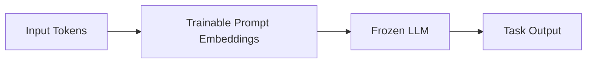

# Prompt Tuning

## Definition
Prompt tuning is a parameter-efficient fine-tuning method where a small number of trainable prompt embeddings are prepended to the input, while the base model weights stay frozen.

## Why Prompt Tuning?
- Very small trainable footprint
- Easy to store per-task prompts
- Works well for large pretrained language models
- Cheaper than full fine-tuning

## Core Idea
The prompt embeddings act like learned instructions that steer the model toward the desired behavior without changing the model itself.

## Prompt Tuning vs Prefix Tuning
| Prompt Tuning | Prefix Tuning |
|---|---|
| Prepends trainable embeddings to input | Adds trainable vectors to attention layers |
| Simpler to think about | More tightly integrated into attention |
| Often used for sequence tasks | Often stronger for some generation tasks |

## Advantages
- Minimal number of trained parameters
- Easy to maintain multiple task-specific prompts
- Base model remains intact
- Storage-friendly for multi-tenant systems

## Trade-offs
- Can underperform larger adaptation methods on harder tasks
- Highly dependent on the quality of the base model
- Prompt length and initialization matter

## Best Practices
- Start with a strong pretrained checkpoint.
- Tune prompt length carefully.
- Compare against LoRA and adapters.
- Validate on task-specific metrics, not just loss.

## Interview Questions
- What is prompt tuning?
- How is it different from prompt engineering?
- Prompt tuning vs prefix tuning?
- When would you choose prompt tuning?