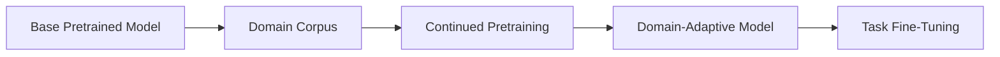

# Continued Pretraining

## Definition
Continued pretraining is the process of further training a pretrained model on additional unlabeled or lightly labeled domain data before task-specific fine-tuning.

## Why It Is Useful
- Adapts a general model to a domain
- Improves vocabulary and domain knowledge
- Often helps more than direct fine-tuning when the domain is very different
- Useful for specialized text, code, medical, legal, or finance corpora

## When to Use It
- When the target domain is far from the original pretraining data
- When you have lots of unlabeled domain data
- When terminology differs heavily from the base model's training distribution

## Risks
- Catastrophic forgetting if overdone
- Extra training cost
- Need to choose data carefully to avoid degrading general capability

## Difference from Fine-Tuning
- Continued pretraining teaches the model new domain language patterns.
- Fine-tuning teaches the model a task like classification, extraction, or generation.

## Best Practices
- Mix some general-domain data if possible.
- Keep learning rate small.
- Evaluate on both domain and general benchmarks.
- Do task fine-tuning after continued pretraining.

## Interview Questions
- What is continued pretraining?
- How is it different from fine-tuning?
- When is it better than prompt tuning or LoRA?
- What is domain-adaptive pretraining?