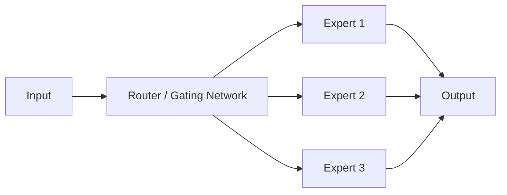

# Mixture of Experts (MoE)

## Definition
Mixture of Experts is a neural network architecture where only a subset of specialized sub-models (experts) is activated for each input token or sample.

## Why MoE?
- Scale model capacity without increasing every forward pass cost
- Improve parameter efficiency
- Specialize different experts for different patterns or domains

## Core Idea
A router decides which experts should process the input. Only top-k experts are used, so the model is sparse during inference and training.

## Advantages
- Large total capacity
- Lower compute than a dense model of similar size
- Useful for very large language models

## Challenges
- Routing instability
- Load balancing across experts
- More complex training and deployment

## Best Practices
- Use a load-balancing loss.
- Keep top-k routing simple at first.
- Monitor expert utilization.
- Validate quality and latency together.

## Interview Questions
- What is a Mixture of Experts?
- Why is MoE sparse?
- What is a router in MoE?
- What is load balancing in MoE?