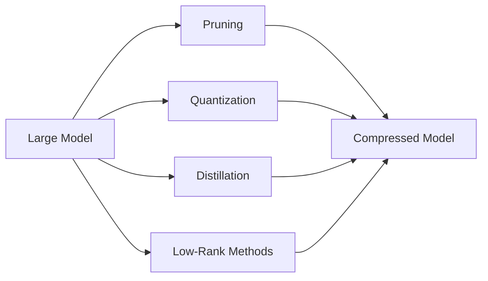

# Neural Network Compression

## Definition
Neural network compression is the set of techniques used to make models smaller, faster, and cheaper to run while trying to keep most of their original quality.

## Why Compression?
- Reduce storage size
- Lower inference latency
- Decrease memory usage
- Make models deployable on edge devices

## Common Compression Methods
- Pruning
- Quantization
- Knowledge Distillation
- Low-rank factorization
- Sparse training
- Weight sharing
- Parameter-efficient fine-tuning

## Trade-offs
- Compression usually reduces accuracy somewhat.
- Different methods work better for different hardware.
- The best method depends on whether you care more about size, latency, or quality.

## Best Practices
- Start with the cheapest method first.
- Measure latency on target hardware.
- Validate accuracy after every compression step.
- Combine methods when needed.

## Interview Questions
- What is model compression?
- Which compression method would you choose for deployment?
- How do pruning and quantization differ?
- Why does compression sometimes hurt accuracy?