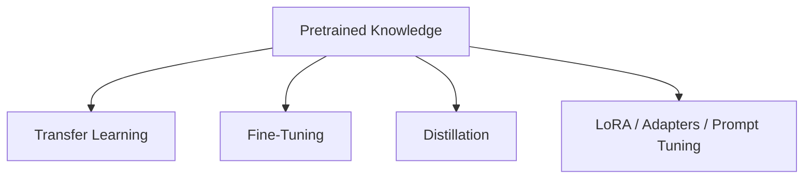

# Knowledge Transfer Techniques Comparison

## Definition
Knowledge transfer techniques are methods used to move useful information from one model to another, usually from a larger or pretrained model to a smaller or task-specific one.

## Main Techniques
| Technique | What Transfers | Trainable Size |
|---|---|---|
| Transfer Learning | Pretrained features and representations | Medium |
| Fine-Tuning | Task adaptation from pretrained model | Medium to Large |
| Distillation | Soft predictions and behavior | Small to Medium |
| LoRA | Low-rank updates | Small |
| Adapters | Small inserted modules | Small |
| Prefix / Prompt Tuning | Learned prefixes or prompt embeddings | Very Small |

## How They Differ

## Choosing the Right Technique
- Use transfer learning when you need a strong starting point for a related task.
- Use fine-tuning when you need strong task adaptation and have enough data.
- Use distillation when deployment cost matters.
- Use PEFT methods like LoRA or adapters when memory is limited.

## Best Practices
- Compare quality, speed, and memory together.
- Start with the least expensive technique that meets your goal.
- Use task-specific validation metrics.

## Interview Questions
- Transfer learning vs fine-tuning?
- Distillation vs LoRA?
- When should you choose prompt tuning?
- Which method is best for small GPUs?